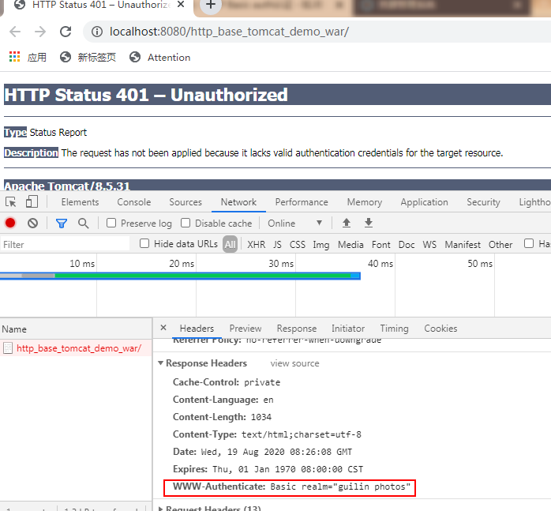
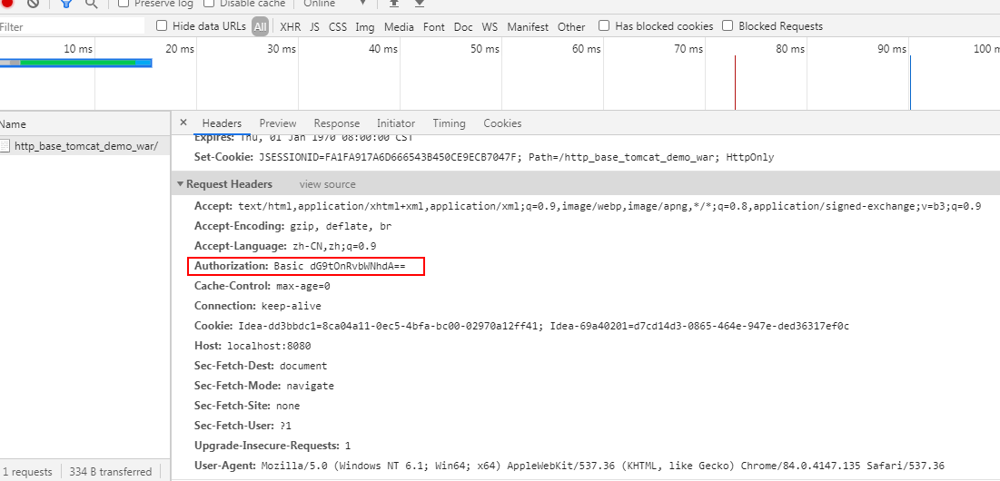

# 认证

### 一、http basic auth认证

### 1、Basic 概述

Basic 认证是HTTP 中非常简单的认证方式，因为简单，所以不是很安全，不过仍然非常常用。当一个客户端向一个需要认证的HTTP服务器进行数据请求时，如果之前没有认证过，HTTP服务器会返回401状态码，要求客户端输入用户名和密码。用户输入用户名和密码后，用户名和密码会经过BASE64加密附加到请求信息中再次请求HTTP服务器，HTTP服务器会根据请求头携带的认证信息，决定是否认证成功及做出相应的响应。

#### 2、使用Tomcat进行Basic认证

tomcat中host-manager应用有此功能

##### 2.1配置项目的 web.xml

示例：

```xml
<?xml version="1.0" encoding="UTF-8"?>
<web-app xmlns:xsi="http://www.w3.org/2001/XMLSchema-instance" xmlns="http://java.sun.com/xml/ns/javaee" 
　　xmlns:web="http://java.sun.com/xml/ns/javaee/web-app_2_5.xsd" 
　　xsi:schemaLocation="http://java.sun.com/xml/ns/javaee http://java.sun.com/xml/ns/javaee/web-app_3_0.xsd" id="WebApp_ID" version="3.0">
  <display-name>lvyou</display-name>
  <servlet>
    <servlet-name>home</servlet-name>
    <servlet-class>com.coder4j.web.servlet.HomeServlet</servlet-class>
  </servlet>
  <servlet-mapping>
    <servlet-name>home</servlet-name>
    <url-pattern>/home.do</url-pattern>
  </servlet-mapping>

    <!-- 下面是Basic认证配置 -->
    <security-constraint>
        <web-resource-collection>
          <web-resource-name>GuiLin</web-resource-name> <!-- 给这个认证起个名字-->
          <url-pattern>/*</url-pattern> <!-- 所有资源都需要认证-->
        </web-resource-collection>

        <auth-constraint>
          <role-name>lvyou</role-name>  <!-- 能访问上述资源的角色-->
        </auth-constraint>
   </security-constraint>

  <login-config>
    <auth-method>BASIC</auth-method> <!-- 认证方式-->
    <realm-name>guilin photos</realm-name> <!-- 认证的提示信息-->
  </login-config>
    <!-- Basic认证配置结束 -->


  <welcome-file-list>
    <welcome-file>index.html</welcome-file>
    <welcome-file>index.jsp</welcome-file>
  </welcome-file-list>
</web-app>
```

##### 2.2修改 tomcat-users.xml

tomcat 提供了用户配置文件，我们直接使用就行了.

```xml
<?xml version='1.0' encoding='utf-8'?>
<tomcat-users>
  <role rolename="lvyou"/>
  <user username="tom" password="tomcat" roles="lvyou"/>
</tomcat-users>
```

至此，两步就完成了Basic 认证，如果想访问我的照片，就需要输入`tom` 和 `tomcat`才行哟。

当然配置方式不止这一种，网上一搜很多的，有机会再整理一部分，这里仅仅想介绍Basic认证。

### 3、Basic 认证的过程

由上面的实战可以得知，Basic认证的流程很简单，现概述如下：

1, 客户端向服务器请求数据，并且请求的数据是需要认证才能看的，并且客户端目前没有认证过。

2, 访问的页面需要认证，客户端弹出认证窗口。

认证窗口关闭之前，浏览器状态一直是：`pending`等待用户输入。

点击 `x` 或取消，将会出现401状态码，响应内容如下：



```xml
WWW-Authorization: Basic realm="guilin photos"
```

表示需要认证，提示信息是guilin photos.

刷新页面，输入正确的用户名和密码，将会进入到我们的项目中

输入用户名和密码的请求信息头如下：



这是我们的认证信息。加密策略如下：

用户名和密码用`:`合并，将合并后的字符串使用BASE64加密为密文，每次请求时，将密文附于请求头中，服务器接收此密文，进行解析，判断是否认证

### 4、Java 实现

通过设置一个过滤器，当返回码是401的时候，客户端会弹出输入账号密码。

当经过过滤器认证通过后，request header中每次请求都会有Authrization的值，不用前端手动配置。

```java
package com.basichttp.filter;

import org.springframework.util.StringUtils;

import javax.servlet.*;
import javax.servlet.http.HttpServletRequest;
import javax.servlet.http.HttpServletResponse;
import java.io.IOException;
import java.util.Base64;

public class CheckAuthFilter implements Filter {

    /**
     * 登录名，写死只有一个用户 admin
     */
    private static final String userid = "admin";

    /**
     * 登录密码
     */
    private static String pwd = "123123";

    /**
     * 报告是否启动的状态，让外界知晓
     */
    public static boolean isEnadble = false;


    @Override
    public void init(FilterConfig filterConfig) throws ServletException {

        if (filterConfig.getInitParameter("adminPassword") != null) {
            pwd = filterConfig.getInitParameter("adminPassword");// 读取 web.xml 配置里的密码
        }

        isEnadble = true;
    }

    @Override
    public void doFilter(ServletRequest servletRequest, ServletResponse servletResponse, FilterChain filterChain) throws IOException, ServletException {
        HttpServletRequest request = (HttpServletRequest) servletRequest;
        HttpServletResponse response = (HttpServletResponse) servletResponse;

        if (!checkAuth(request)) {
            String msg = "\"Please input your account\""; // 如果认证失败,则要求认证 ，不能输入中文

            response.setCharacterEncoding("utf-8");
            response.setStatus(401);// 发送状态码 401, 不能使用 sendError，坑
            response.setHeader("WWW-Authenticate", "Basic realm=" + msg);// 发送要求输入认证信息,则浏览器会弹出输入框
            response.setCharacterEncoding("utf-8");
            response.getWriter().append("<meta charset=\"utf-8\" />Please login! 请登录系统！");

        } else {
            // request.setAttribute("userName", userid);
            // 验证通过，可以在此设置session中的用户信息
            filterChain.doFilter(request, response);
        }
    }

    @Override
    public void destroy() {

    }

    /**
     * 检查是否合法登录
     *
     * @param request 请求对象
     * @return 是否合法登录
     */
    private static boolean checkAuth(HttpServletRequest request) {
        return checkAuth(request.getHeader("Authorization"), userid, pwd);
    }


    /**
     * 是否不合法的数组
     *
     * @param arr
     * @return 是否不合法的数组
     */
    private static boolean isBadArray(String[] arr) {
        return arr == null || arr.length != 2;
    }

    /**
     * 检查是否合法登录
     *
     * @param authorization 认证后每次HTTP请求都会附带上 Authorization 头信息
     * @param username 用户名
     * @param password 密码
     * @return true = 认证成功/ false = 需要认证
     */
    private static boolean checkAuth(String authorization, String username, String password) {
        if (StringUtils.isEmpty(authorization)) {
            return false;
        }

        String[] basicArray = authorization.split("\\s+");
        if (isBadArray(basicArray)) {
            return false;
        }
        String idpass = new String(Base64.getDecoder().decode(basicArray[1]));
        if (StringUtils.isEmpty(idpass)) {
            return false;
        }

        String[] idpassArray = idpass.split(":");
        if (isBadArray(idpassArray)) {
            return false;
        }

        return username.equalsIgnoreCase(idpassArray[0]) && password.equalsIgnoreCase(idpassArray[1]);
    }
    
}
```

Basic认证的核心就是响应401状态码，告知浏览器需要用户输入用户名和密码，然后就是后台按照Basic加密的方式进行解密验证即可。